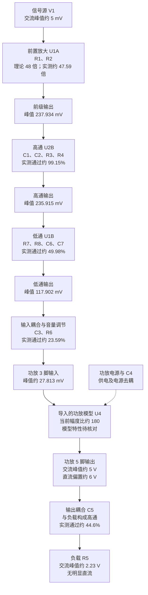

## 完整电路链路框图

```mermaid
flowchart TD
    IN["信号源 V1<br/>交流峰值约 5 mV"] --> PRE["前置放大 U1A<br/>R1、R2<br/>理论 48 倍；实测约 47.59 倍"]
    PRE --> N1["前级输出<br/>峰值 237.934 mV"]
    N1 --> HP["高通 U2B<br/>C1、C2、R3、R4<br/>实测通过约 99.15%"]
    HP --> N2["高通输出<br/>峰值 235.915 mV"]
    N2 --> LP["低通 U1B<br/>R7、R8、C6、C7<br/>实测通过约 49.98%"]
    LP --> N3["低通输出<br/>峰值 117.902 mV"]
    N3 --> VOL["输入耦合与音量调节<br/>C3、R6<br/>实测通过约 23.59%"]
    VOL --> P3["功放 3 脚输入<br/>峰值约 27.813 mV"]
    P3 --> PA["导入的功放模型 U4<br/>当前幅度比约 180<br/>模型特性待核对"]
    PA --> P5["功放 5 脚输出<br/>交流峰值约 5 V<br/>直流偏置约 6 V"]
    P5 --> CO["输出耦合 C5<br/>与负载构成高通<br/>实测通过约 44.6%"]
    CO --> LOAD["负载 R5<br/>交流峰值约 2.23 V<br/>无明显直流"]
    POWER["功放电源与 C4<br/>供电及电源去耦"] -.-> PA
```
